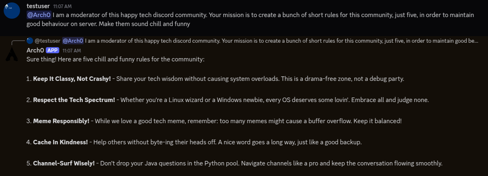

# 🚀 Arch0
### AI-powered Discord chatbot, moderator, and remote content broadcaster always watching, always learning.

## 📚 Table of Contents

1. [Screenshots / Diagram](#-1-live-demo--screenshots--video)
2. [Overview](#-2-overview--introduction)
3. [Features](#-3-features)
4. [Tech Stack](#-4-tech-stack)
5. [Project Structure](#-5-project-structure)
6. [Getting Started](#-6-getting-started)
7. [Example Usage](#-7-example-usage)
8. [API Documentation](#-8-api-documentation)
9. [Performance & Benchmarks](#-9-performance--benchmarks)
10. [Model Info](#-10-model-info)
11. [Roadmap or Future Features](#-11-roadmap-or-future-features)
12. [Contributing](#%EF%B8%8F-12-contributing)
13. [Contact](#-13-contact)

## 📸 1. Live Demo / Screenshots / Video


## 🧠 2. Overview / Introduction
**Arch0 is an autonomous AI Discord bot that acts as:**
* Discord chatbot based on disnake
* A natural language chatbot using GPT-based intelligence
* A content relay system receiving posts from an Android app via a Gethonis API based on FastAPI

**Designed for:**
* Discord server admins who want automated help
* Communities that need 24/7 moderation
* Content creators who want mobile-to-server posting

**Key strengths:**
* GPT-4 conversational AI
* Secure Fast API endpoint
* Hosted on Hetzner VPS for high availability
* Modular structure for easy expansion and maintenance

## ✨ 3. Features
* Smart, AI-powered chatbot with personality
* Admin commands: kick, ban, purge, filter, etc.
* Secure POST endpoint for mobile content publishing
* Self-hosted on a virtual server (no downtime)
* Environment variable config (.env support)

## 🧰 4. Tech Stack
| Layer |Technologies Used |
| -------- | -------- |
|Bot Engine | Disnake|
|API | Gethonis API|
|AI Models | OpenAI GPT-4, Gethonis|
|Hosting | Hetzner VPS (Linux Ubuntu)|
|Auth | Bearer token via `.env`|
|Deployment | Docker|
|CI/CD | Github Actions|

## 📂 5. Project Structure
```
Arch0/
├── tests/                        # Unit and integration tests
├── utils/
│   ├── ai.py                     # Artificial Intelligence based user interaction and commands
│   ├── config.py                 # Were most most of key data is loaded from .env such as tokens and datas
│   ├── discordbot.py             # Where all the classes are imported and connection initialised
│   ├── moderation.py             # For moderation commands and operations
│   ├── showingcommands.py        # Simple showing commands with not very much user interaction
├── Dockerfile                    # Config file for docker container
├── bot.py                        # Main startup script which is linked with discordbot
├── README.md
└──  requirements.txt
```

## 🚀 6. Getting Started
Prerequisites:
* Python 3.10 or higher
* A registered Discord bot token
* OpenAI API key
* Hetzner VPS(or any linux host)

### 🛠 Installation
* Clone the repo
* ```pip install -r requirements.txt```
* Create `.env` with required tokens
* Run with `python bot.py`

**If you want to run it with Docker:**
* Clone the repo
* Install Docker
* ```sudo docker build -t arch0 .```
* ```sudo docker run -d --restart unless-stopped --name arch0-bot arch0```

## 📬 7. Example Usage
* Generate your invite
* Invite it in your discord server
* Mention him in your server and he will respond quickly

## 📄 8. API Documentation
For API Documentation see [Gethonis API Repo](https://github.com/lucian-xinitrc/GethonisAIApi)

## 📈 9. Performance & Benchmarks
| Metric | Value |
| -------- | -------- |
|Average latency | 60 ms|
|Vps Uptime | 99.9% (systemd or Docker auto-restart)|
|Ram usage | ~150–200 MB |

## 🧠 10. Model Info
* Language Model: GPT-4 via OpenAI API, Gethonis AI API
* Role: Helfpul, assertive assistant and mod
* Prompt customisation via `arch0_training` in `.env`

## 💡 11. Roadmap or Future Features
* Logging system for moderation events
* Memory for contextual chat
* Monitoring (Prometheus + Grafana)

## 🙋‍♂️ 12. Contributing
* Fork the repository
* Create a new branch
* Add your change
* Push and open a Pull Request

## 📫 13. Contact
Name: Lucian-Florin Cusmir

Github: [github.com/lucian-xinitrc](https://github.com/lucian-xinitrc)

Email: cusmirlucian@gmail.com
